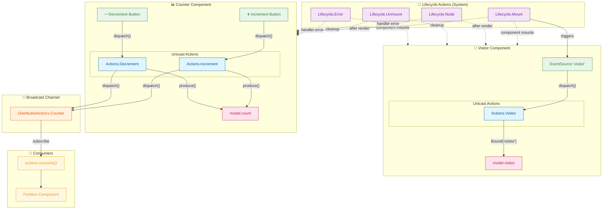

# Dispatch Relationships

This diagram illustrates the action dispatch flow in the Chizu example application.

## Dispatch Types

| Type          | Scope              | Emitter                    | Use Case                      |
| ------------- | ------------------ | -------------------------- | ----------------------------- |
| **Unicast**   | Local to component | Per-component EventEmitter | Component-specific actions    |
| **Broadcast** | Global across app  | Shared EventEmitter3       | Cross-component communication |

## Flow Summary

1. **User Interaction** → Button clicks dispatch unicast actions
2. **Action Handlers** → Update local model state via `produce()`
3. **Broadcast Dispatch** → Handlers emit `DistributedActions.Counter` to broadcast channel
4. **Cross-Component Consumption** → Visitor component subscribes via `actions.consume()`
5. **Reactive Rendering** → `Partition` component re-renders with new counter value

## Action Registry

### Counter Component (`counter/types.ts`)

- `Actions.Increment` - Increments count (async, with 1s delay between increments)
- `Actions.Decrement` - Decrements count (sync)

### Visitor Component (`visitor/types.ts`)

- `Actions.Visitor` - Updates visitor data from EventSource

### Distributed (`types.ts`)

- `DistributedActions.Counter` - Broadcasts counter value across components
