# Dispatch Relationships

This diagram illustrates the action dispatch flow in the Chizu example application.

```mermaid
flowchart TB
    subgraph Lifecycle["🔄 Lifecycle Actions (System)"]
        Mount["Lifecycle.Mount"]
        Unmount["Lifecycle.Unmount"]
        Error["Lifecycle.Error"]
        Node["Lifecycle.Node"]
    end

    subgraph CounterComponent["📊 Counter Component"]
        subgraph CounterActions["Unicast Actions"]
            Increment["Actions.Increment"]
            Decrement["Actions.Decrement"]
        end

        IncrementBtn["➕ Increment Button"]
        DecrementBtn["➖ Decrement Button"]
        CounterModel["model.count"]
    end

    subgraph VisitorComponent["👤 Visitor Component"]
        subgraph VisitorActions["Unicast Actions"]
            Visitor["Actions.Visitor"]
        end

        EventSource["EventSource 'visitor'"]
        VisitorModel["model.visitor"]
    end

    subgraph Broadcast["📡 Broadcast Channel"]
        BroadcastCounter["Actions.Broadcast.Counter"]
    end

    subgraph Subscription["🎯 Subscribers"]
        VisitorSubscribe["useAction / useDerived"]
    end

    %% User interactions
    IncrementBtn -->|"dispatch()"| Increment
    DecrementBtn -->|"dispatch()"| Decrement

    %% Counter action handlers
    Increment -->|"produce()"| CounterModel
    Decrement -->|"produce()"| CounterModel

    %% Counter broadcasts to broadcast channel
    Increment -->|"dispatch()"| BroadcastCounter
    Decrement -->|"dispatch()"| BroadcastCounter

    %% Lifecycle triggers visitor
    Mount -->|"triggers"| EventSource
    EventSource -->|"dispatch()"| Visitor
    Visitor -->|"Bound('visitor')"| VisitorModel

    %% Broadcast subscription
    BroadcastCounter -->|"subscribe"| VisitorSubscribe

    %% Lifecycle connections
    Mount -.->|"component mounts"| CounterComponent
    Mount -.->|"component mounts"| VisitorComponent
    Unmount -.->|"cleanup"| CounterComponent
    Unmount -.->|"cleanup"| VisitorComponent
    Error -.->|"handler error"| CounterComponent
    Error -.->|"handler error"| VisitorComponent
    Node -.->|"ref captured"| CounterComponent
    Node -.->|"ref captured"| VisitorComponent

    %% Styling
    classDef unicast fill:#e1f5fe,stroke:#01579b,color:#01579b
    classDef broadcast fill:#fff3e0,stroke:#e65100,color:#e65100
    classDef lifecycle fill:#f3e5f5,stroke:#7b1fa2,color:#7b1fa2
    classDef interaction fill:#e8f5e9,stroke:#2e7d32,color:#2e7d32
    classDef model fill:#fce4ec,stroke:#c2185b,color:#c2185b
    classDef subscriber fill:#fff8e1,stroke:#ff8f00,color:#ff8f00

    class Increment,Decrement,Visitor unicast
    class BroadcastCounter broadcast
    class Mount,Unmount,Error,Node lifecycle
    class IncrementBtn,DecrementBtn,EventSource interaction
    class CounterModel,VisitorModel model
    class VisitorSubscribe subscriber
```

## Dispatch Types

| Type          | Scope              | Emitter                    | Use Case                      |
| ------------- | ------------------ | -------------------------- | ----------------------------- |
| **Unicast**   | Local to component | Per-component EventEmitter | Component-specific actions    |
| **Broadcast** | Global across app  | Shared EventEmitter3       | Cross-component communication |

## Flow Summary

1. **User Interaction** → Button clicks dispatch unicast actions
2. **Action Handlers** → Update local model state via `produce()`
3. **Broadcast Dispatch** → Handlers emit `Actions.Broadcast.Counter` to broadcast channel
4. **Cross-Component Subscription** → Visitor component subscribes via `useAction` or `useDerived`
5. **Reactive Rendering** → Component re-renders when model updates

## Action Registry

### Counter Component (`counter/types.ts`)

- `Actions.Increment` - Increments count (async, with 1s delay between increments)
- `Actions.Decrement` - Decrements count (sync)

### Visitor Component (`visitor/types.ts`)

- `Actions.Visitor` - Updates visitor data from EventSource

### Broadcast (`types.ts`)

- `BroadcastActions.Counter` - Broadcasts counter value across components
